# 🌾 Stardew Valley Style Farm Game

<p align="center">
  <strong>基于 Unity 开发的 2D 像素风农场模拟游戏</strong><br>
  <em>实现种植、收割、库存管理、时间系统等完整游戏循环</em>
</p>

---

## 🎮 游戏截图
### 游戏开始菜单
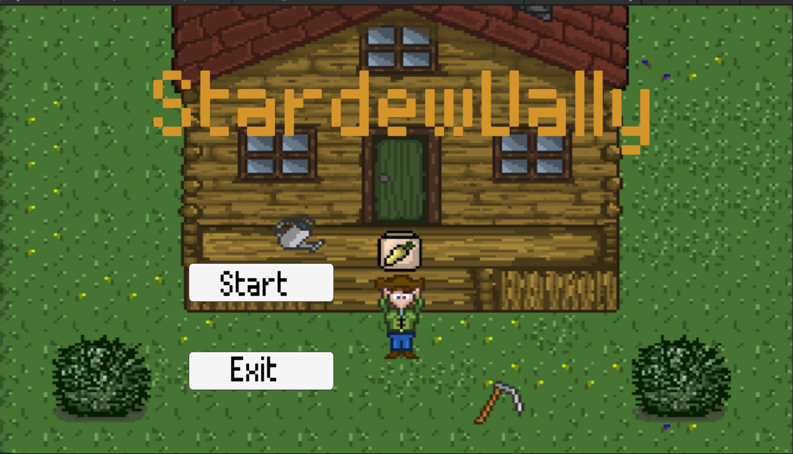


### 🌾 游戏主界面
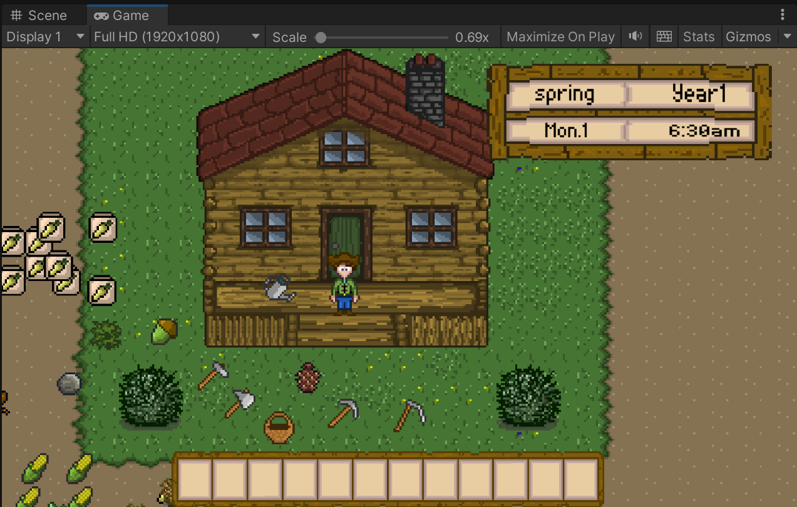


### 拾取物品
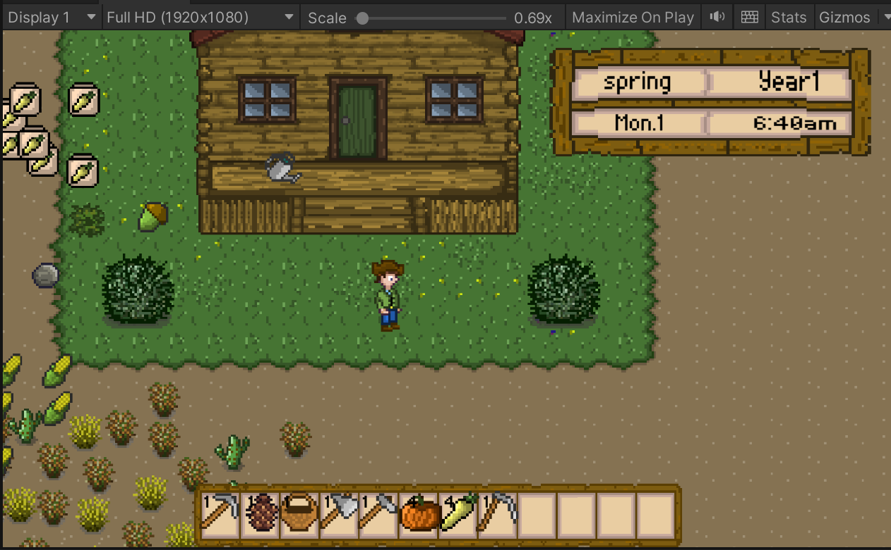


### 场景持久化
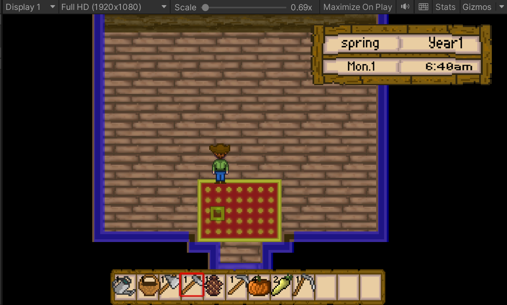
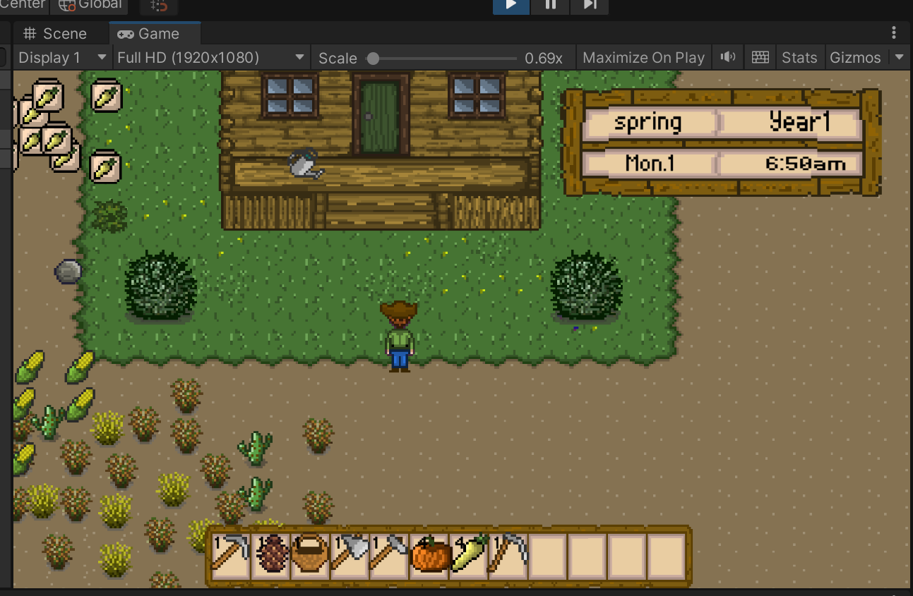


### 耕地，种植，收割
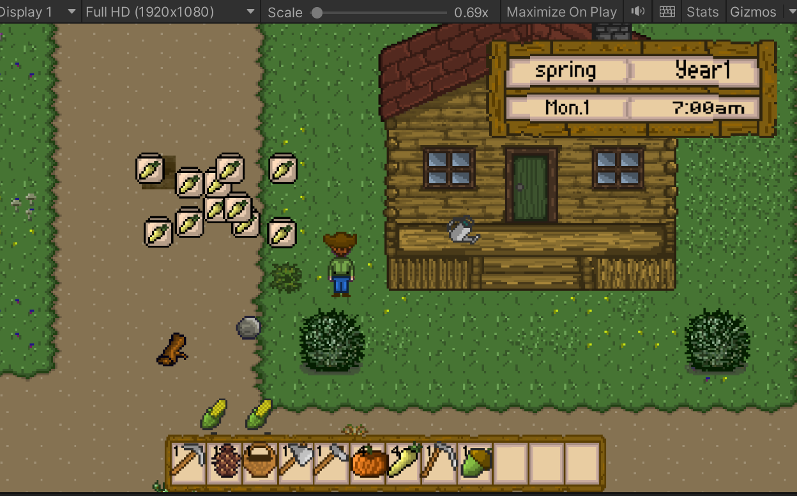
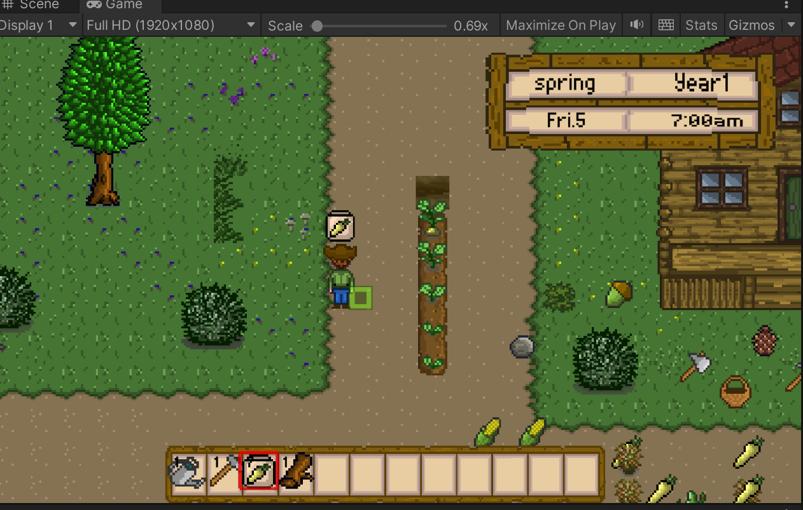
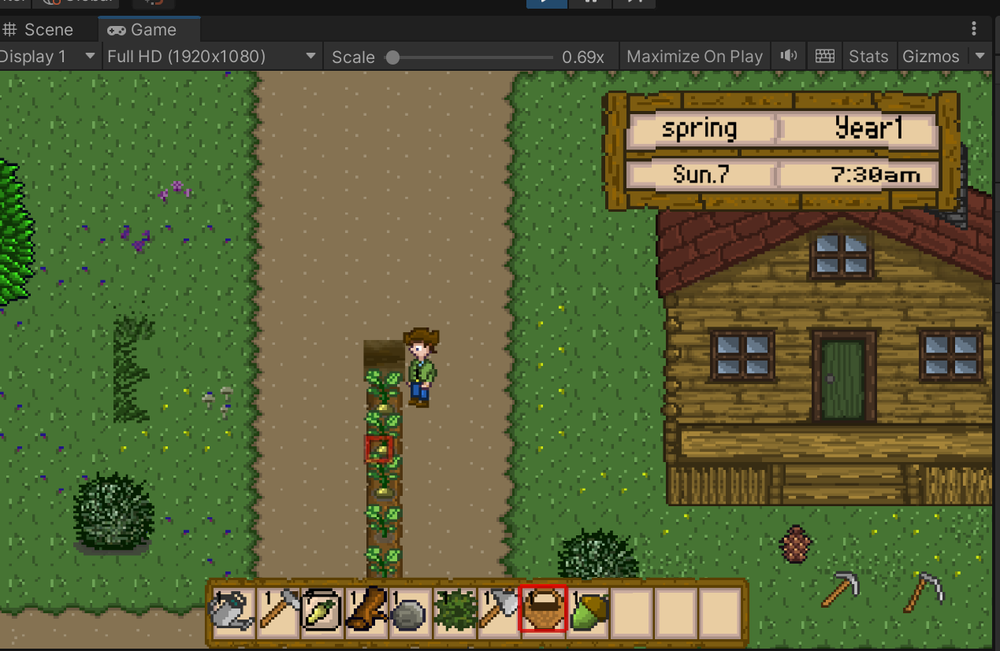
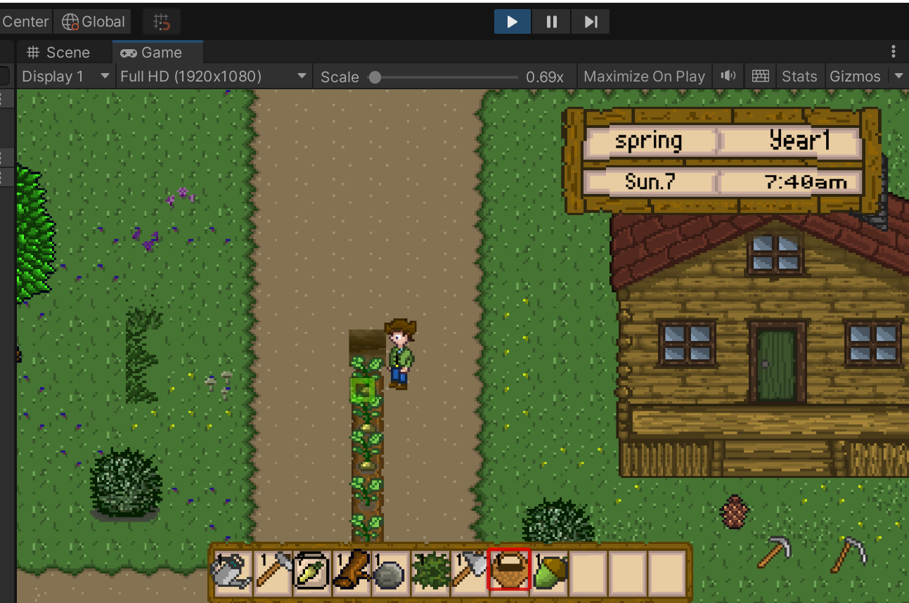
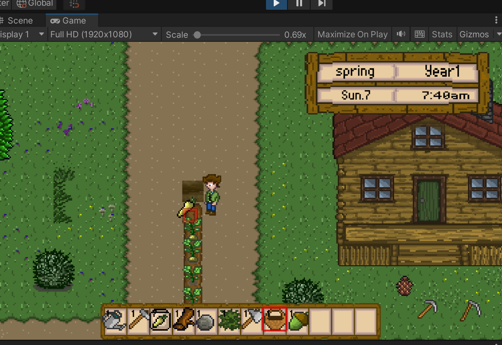


### 丢弃物品
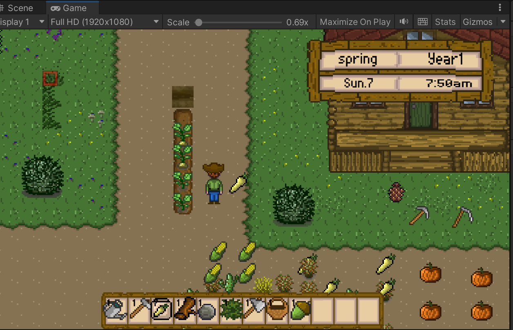
---

##  核心功能

###  农场系统
- **耕地系统**：使用锄头挖掘土地，支持动态耕地贴片拼接
- **种植系统**：在耕地上播种，支持多种作物类型
- **浇水系统**：使用水壶灌溉作物，加速生长
- **收割系统**：作物成熟后用篮子收集，自动生成掉落物
- **生长系统**：多阶段生长状态机，数据驱动配置生长周期

###  玩家系统
- **移动控制**：WASD/方向键控制，支持行走/跑步切换
- **工具使用**：锄头、水壶、篮子等多种工具交互
- **动画系统**：4方向动画 + 工具使用/拾取动作
- **角色定制**：部件组合换装系统

### 库存系统
- **物品栏**：24格背包，支持物品拖拽和堆叠
- **物品类型**：种子、工具、商品、可拾取物品
- **ScriptableObject配置**：可视化编辑物品属性

### 时间系统
- **游戏时钟**：现实时间映射到游戏时间（分钟/小时/天）
- **季节循环**：春夏秋冬四季切换
- **时间事件**：驱动作物生长、场景变化

###  存档系统
- **自动存档**：场景切换时自动保存
- **数据持久化**：网格属性、库存、玩家状态完整保存

---

##  技术栈

| 类别 | 技术 |
|------|------|
| 引擎 | Unity 2020.3 LTS |
| 语言 | C#|
| 架构 | MVC + 单例模式 + 事件驱动 |
| 地图 | Tilemap + Grid System |
| 动画 | Animator Controller + Override Controller |
| 数据 | ScriptableObject + JSON |
| 性能优化 | 对象池 (Object Pooling) |
| 设计模式 | 状态机、观察者、单例|

---

##  项目架构

```
Assets/
├── Script/
│   ├── Core/              # 核心系统（单例基类）
│   ├── Map/               # 地图与网格系统
│   │   ├── GridCursor.cs          # 光标管理
│   │   ├── GridPropertiesManager.cs # 网格属性
│   │   └── GridPropertyDetails.cs  # 数据模型
│   ├── Player/            # 玩家系统
│   │   ├── PlayerManager.cs        # 玩家控制器
│   │   └── ToolUseManager.cs       # 工具使用
│   ├── Crop/              # 作物系统
│   │   └── Parsnip.cs             # 作物逻辑
│   ├── Inventory/         # 库存系统
│   ├── Items/             # 物品系统
│   ├── TimeEvent/         # 时间系统
│   ├── SaveSystem/        # 存档系统
│   ├── Events/            # 事件总线
│   └── Miscellaneous/     # 工具类
├── Prefab/                # 预制体资源
├── Scenes/                # 场景文件
└── ScriptableObject/      # 配置资产
```

---

##  核心技术亮点

### 1. 事件驱动架构
```csharp
// EventHandler 解耦模块通信
public static event MovementDelegate MovementEvent;
EventHandler.CallMovementEvent(x, y, isWalking, ...);
```

### 2. 单例管理器模式
```csharp
// 全局唯一访问点
public class PlayerManager : Singleton<PlayerManager>
{
    PlayerManager.Instance.SomeMethod();
}
```

### 3. 对象池性能优化
```csharp
// 避免高频 Instantiate/Destroy
GameObject obj = PoolManager.Instance.ReuseObject(prefab, pos, rot);
PoolManager.Instance.ReturnToPool(prefab, obj);
```

### 4. 接口化存档系统
```csharp
// ISaveable 统一接口规范
public interface ISaveable
{
    void ISaveableRegister();
    void ISaveableStoreScene(string sceneName);
    void ISaveableRestoreScene(string sceneName);
}
```

### 5. 协程异步时序控制
```csharp
// 精确编排动画流程
yield return useToolAnimationPause;
ExecuteToolAction();
yield return afterToolAnimationPause;
RestorePlayerState();
```

---

##  快速开始

### 环境要求
- **Unity**: 2020.3 LTS 或更高版本
- **平台**: Windows / macOS

### 安装步骤

1. **克隆仓库**
git clone https://github.com/你的用户名/StardewVally.git
cd StardewVally
```

2. **打开项目**
   - 启动 Unity Hub
   - 点击 "Add" 添加项目文件夹
   - 打开项目（Unity 会自动导入资源）

3. **运行游戏**
   - 在 Project 窗口打开 `Assets/Scenes/Scene1_Farm.unity`
   - 按 `Ctrl+P`（Windows）

### 操作说明

| 按键 | 功能 |
|------|------|
| WASD / 方向键 | 移动角色 |
| 鼠标左键 | 使用工具/交互 |
| Shift | 切换行走/跑步 |
| T | 测试推进1分钟 |
| G | 测试推进1天 |
| E/F/C | 切换场景 |

---

## 项目统计

- **代码文件**: 46个 C# 脚本
- **代码行数**: 约 3000 行
- **开发周期**: 1个月
- **场景数量**: 3 个（农场/田野/小屋）

---

## 👨‍💻 作者

**你的名字**  
- GitHub: [@你的用户名](https://github.com/你的用户名)
- 邮箱: your.email@example.com

